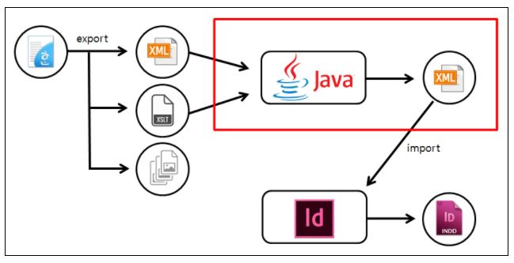
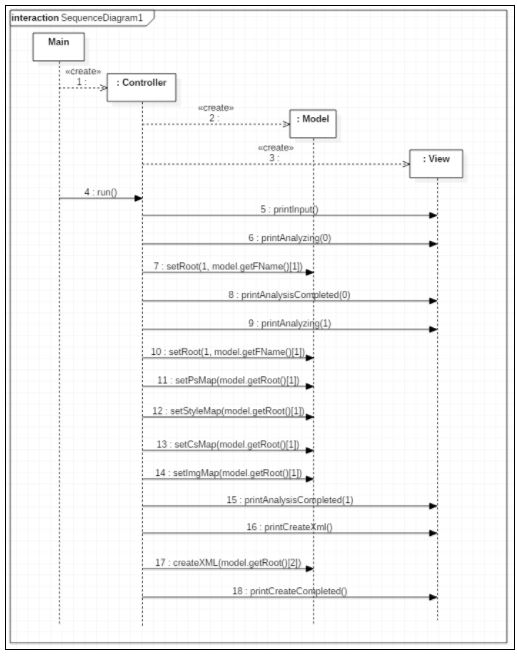
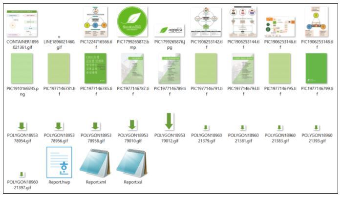
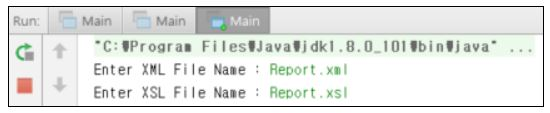
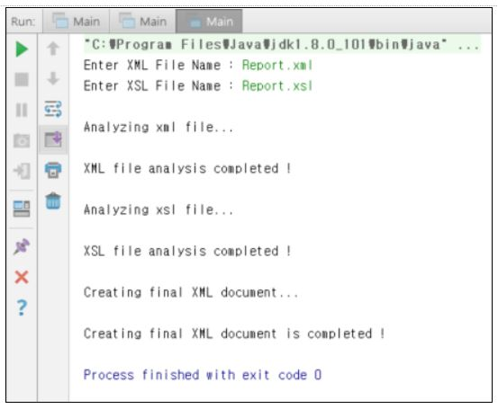
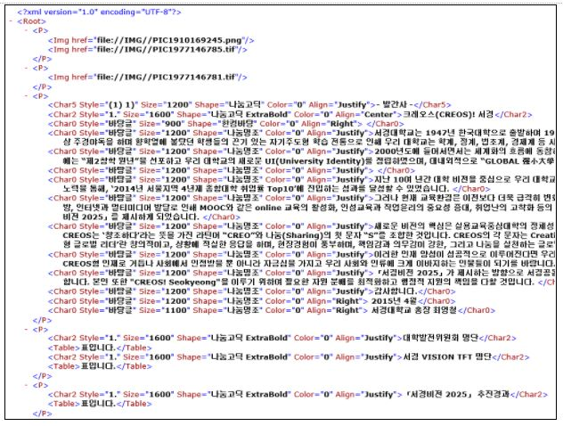
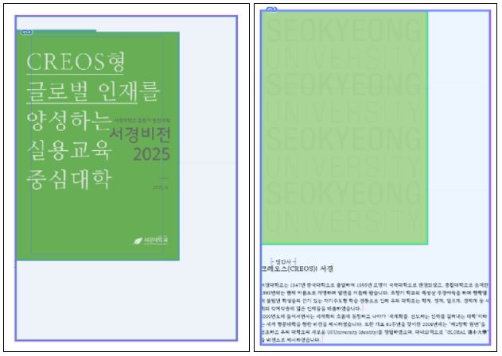
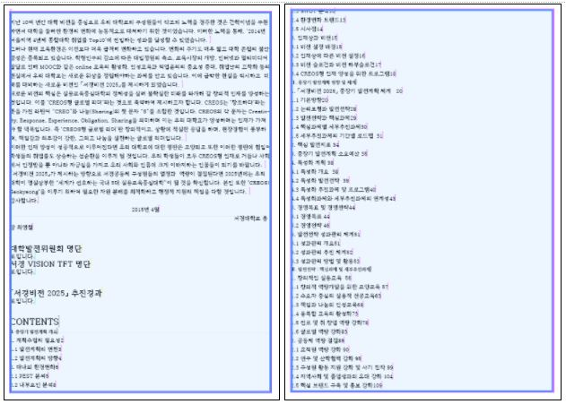
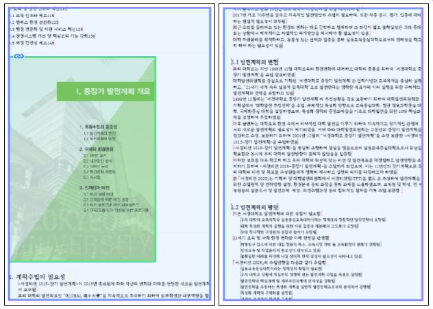

### 편집자동화 프로세스 구축
---
 - 개요
   - 기획 의도
   >- 한글(.hwp) 파일은 Adobe InDesign으로 책자를 만들거나 할 때 포맷팅이 깨져 일일이 편집을 수행해야하는 불편함이 있음
   >- 한글(.hwp) 파일을 Adobe InDesign의 XML 자동조판에 최적화할 수 있는 프로세스 구축
   - 기획 목표
   >- 효율적이고 합리적인 편집 자동화 프로세스를 구축하여 업무 효율 극대화
   >- 하나의 소스를 가지고 홈페이지, 인쇄물 등등 다양하게 사용하기 위한 표준을 만든다.
   - 요청사항
    >- .hwp -> .xml
       - 한글(.hwp) 파일을 InDesign에서 import 하여 사용 할 수 있는 XML 형식으로 변환
       - 글자가 가지고 있는 속성(작은 타이틀, 큰 타이틀), 표, 이미지를 온전히 가져오기
    >- 한글 파일 포멧팅
       - 목차, 스타일 잡는 순서 등을 어떻게 포멧팅하면 자동화가 편리하겠는가?
 - 시스템 구성도
 
 
 
 - 시연
   - 한글(.hwp) 파일을 XML로 export -> xml, xslt, image 파일이 추출된다.
   
   
   - 프로그램을 실행시켜 한글(.hwp) 파일에서 export된 .xml & .xsl 파일명 입력
   
   
   - 파일 분석 후 최종 XML 문서 생성 완료
   
   
   - 생성된 최종 XML 문서
   
   
   - Internet Explorer로 열어본 XML 문서
   
   
   - Adobe InDesign Import XML하여 Map Tags to Styles 적용
   
   
   
   
